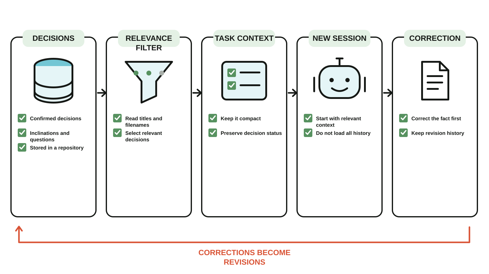
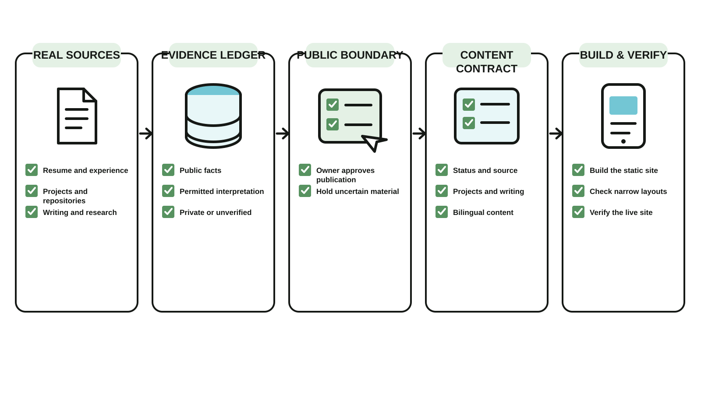
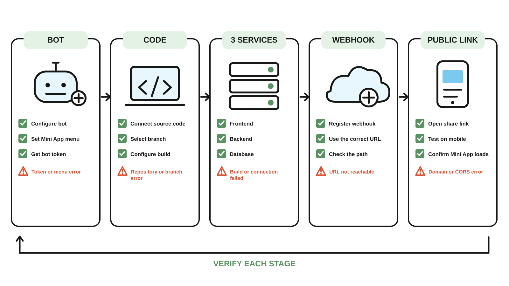

# alexliu.readme

The independent source for Alex Liu's personal website.

## Featured public projects

| [Cairn Context](https://github.com/alexliu072903-bit/cairn-context) | [Evidence-First Personal Site](https://github.com/alexliu072903-bit/evidence-first-personal-site) |
| --- | --- |
|  |  |
| Relevant confirmed decisions for a fresh Agent session. | A personal-site workflow with explicit evidence and publication boundaries. |

| [Mechanism Illustration Skill](https://github.com/alexliu072903-bit/mechanism-illustration-skill) | [Telegram Mini App Fastbuild](https://github.com/alexliu072903-bit/tg-miniapp-fastbuild) |
| --- | --- |
|  |  |
| Deterministic bilingual SVG diagrams with Pipeline, Filter, and Loop layouts. | A verified deployment path through BotFather, GitHub, Railway, and Webhooks. |

## Local development

```sh
npm install
npm run dev
```

## Publishing

Pushes to `main` are built and deployed to GitHub Pages by `.github/workflows/deploy.yml`.

The initial GitHub Pages URL is:

`https://alexliu072903-bit.github.io/alexliu.readme/`

The existing `alexliu.lol` website and DNS configuration are intentionally unchanged.
